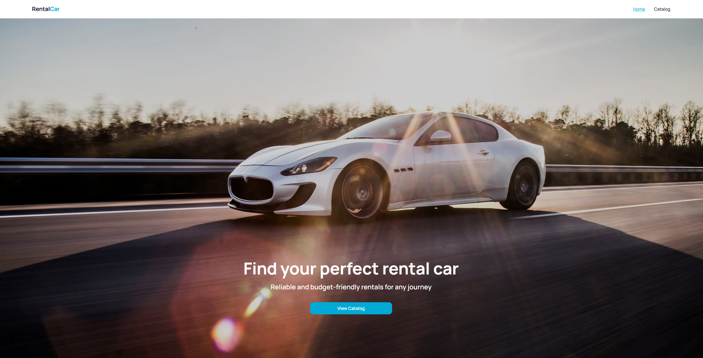
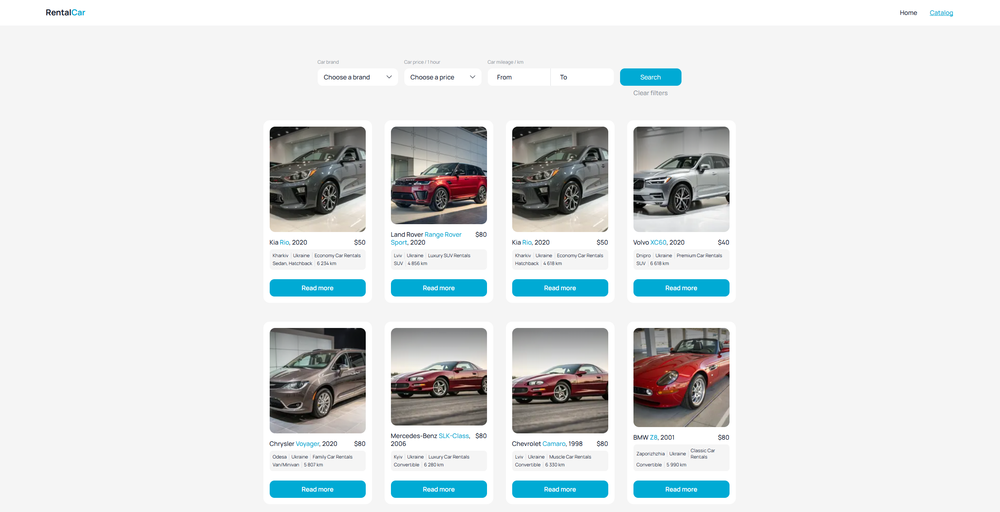
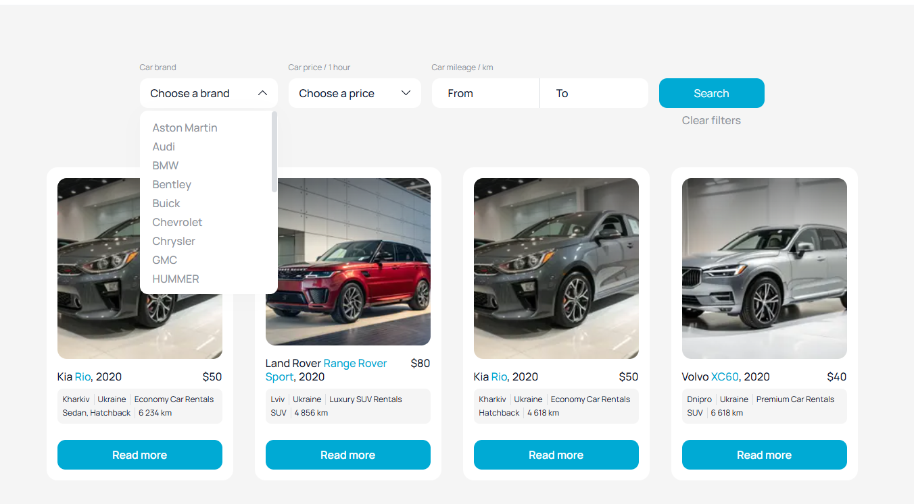
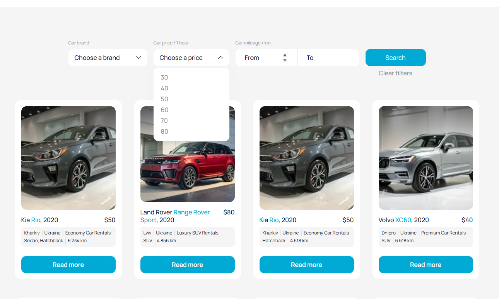
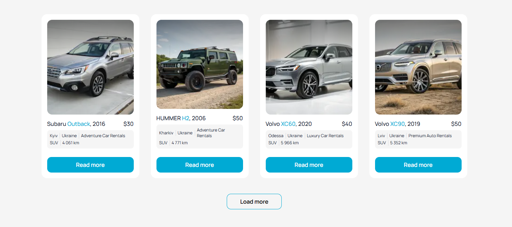
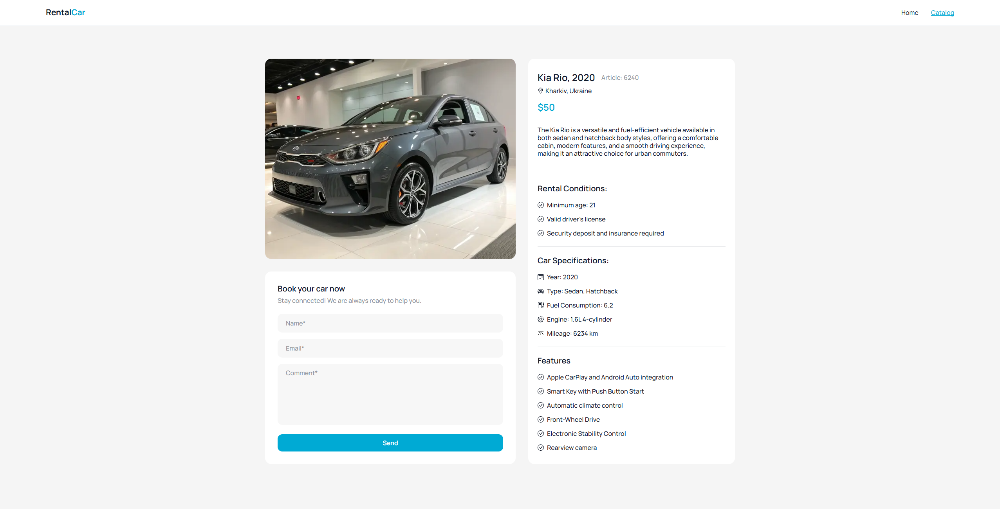

# RentalCar

> Каталог оренди автомобілів — переглядайте, фільтруйте та бронюйте авто онлайн.




**🔗 Живий сайт:** [rental-car-alpha-red.vercel.app](https://rental-car-alpha-red.vercel.app/)

## Про проєкт

RentalCar — це невеликий вебсайт для оренди автомобілів, що включає маркетингову головну сторінку, каталог авто з фільтрацією та пагінацією типу «нескінченний скрол», а також сторінку з детальною інформацією про конкретний автомобіль і формою запиту на бронювання.

Проєкт виконаний як дипломна робота магістерського курсу з Next.js — за фіксованим технічним завданням і макетом Figma.

## Функціональні можливості

- **Фільтрація на стороні сервера (backend-driven)** — бренд, максимальна ціна та діапазон пробігу передаються як параметри запиту до API під час кожного пошуку; фільтрація не виконується на клієнті з уже завантаженого списку. Стан фільтрів зберігається в URL (через `useSearchParams`/`useRouter`), а не у стані компонента, тому відфільтрований вигляд зберігається після оновлення сторінки, переходу за посиланням або натискання кнопки «Назад» у браузері.
- **Каталог із нескінченною прокруткою** — пагінація реалізована через `useInfiniteQuery` (TanStack Query v5) та кнопку «Load more»; запити прив'язані до активних фільтрів, завдяки чому контекст фільтрації не втрачається і не змішується під час завантаження нових сторінок.
- **Єдиний інтерфейс завантаження** для всіх асинхронних станів каталогу — перше завантаження, зміна фільтрів, «Load more» та повторний пошук після порожнього результату використовують один і той самий оверлей (`RefetchOverlay`), що керується єдиним прапорцем `isFetching` замість чотирьох окремих станів завантаження.
- **Кастомний інтерфейс замість стандартних рішень** — власноруч створений анімований індикатор завантаження (колесо, що обертається, та рухома дорога в кольорах бренду), кастомні випадаючі списки (нативні `<select>` неможливо стилізувати відповідно до макетів Figma, тому їх створено з нуля з підтримкою клавіатури й закриттям при кліку поза межами елемента) та SVG-спрайт іконок замість залежності від сторонньої бібліотеки.
- **Форма бронювання з адаптивною версткою** — Formik + Yup; коли в полі виникає помилка (плаваюча червона мітка, вбудована іконка, повідомлення), збільшується простір лише цього конкретного поля, а решта форми та її вирівнювання відносно сусідньої інформаційної панелі залишаються незмінними.
- **Розумна кнопка повернення вгору** — з'являється після прокручування значної частини каталогу незалежно від кількості сторінок, завантажених через «Load more», тому не зникає і не мерехтить щоразу, коли додаються нові автомобілі.
- **SEO-метадані для кожного маршруту** — статичні метадані для `/` та `/catalog`, і динамічна генерація (`generateMetadata`) для сторінки автомобіля (title, description, Open Graph, Twitter card будуються з реальних даних про авто); запити даних дедуплікуються через `cache()` з React, щоб генерація метаданих і рендеринг сторінки не подвоювали мережеві запити.
- **Пріоритет серверного рендерингу там, де це виправдано** — сторінка деталей автомобіля реалізована як Server Component, що отримує дані напряму (без клієнтського індикатора завантаження для контенту, якому це не потрібно); лише форма бронювання — справді інтерактивна частина — постачається як клієнтський JavaScript.

## Технологічний стек

| Шар | Технологія |
|---|---|
| Фреймворк | Next.js 16.3.4 (App Router) |
| Мова | TypeScript (strict) |
| UI | React 19.2.8 + React Compiler |
| Стилі | CSS Modules |
| Серверний стан | TanStack Query v5 (`useInfiniteQuery`) |
| Форми | Formik + Yup |
| HTTP | Axios |
| Сповіщення | react-hot-toast |
| Іконки | Власноруч зроблений SVG-спрайт (`public/sprite.svg`) |

## Скріншоти

**Каталог**


**Фільтр за брендом**


**Фільтр за ціною**


**Пагінація «Load more»**


**Сторінка автомобіля — фото, форма бронювання та повна інформація**


## Архітектура

```
app/
├─ page.tsx                    Home — статична маркетингова сторінка (Server Component)
├─ layout.tsx                  Кореневий layout: шрифти, metadata, TanStack provider, toast portal
├─ not-found.tsx                Спільна 404-сторінка (автоматично для будь-якого notFound())
├─ catalog/
│  ├─ page.tsx                 Тонка серверна обгортка (Suspense-межа для useSearchParams)
│  └─ Catalog.client.tsx        Уся логіка каталогу — фільтри, infinite query, рендер списку
└─ catalog/[id]/
   └─ page.tsx                 Server Component: фетч авто, generateMetadata, обробка 404,
                                рендерить CarDetails (server) + BookingForm (client) поруч

components/
├─ CarCard, CarDetails, Header, EmptyError, Loader, RefetchOverlay, ScrollToTop   → Server/презентаційні
├─ FilterForm (+ CustomSelect), BookForm/BookingForm                              → Client (форми, події)
└─ TanStackProvider                                                              → Client (QueryClientProvider)

lib/api.ts       — усі запити до API в одному місці (fetchCars, fetchCarById, fetchFilters, createBookingRequest)
types/car.ts     — спільні типи, що відповідають контракту API
```

Правило, що визначає, чи компонент серверний, чи клієнтський, — **звідки беруться його дані**. Якщо власні дані компонента надходять із клієнтського хука (`useInfiniteQuery`, `useSearchParams`), усі залежні від нього компоненти теж мають бути клієнтськими — тому вся сторінка `/catalog` є єдиним деревом клієнтських компонентів. Якщо дані отримуються через звичайний серверний `await`, компонент за замовчуванням лишається серверним — тому сторінка деталей рендериться на сервері, за винятком єдиного елемента, що потребує реальної інтерактивності (форми бронювання).

### Чому на сторінці деталей немає SSR data-prefetch

TanStack Query підтримує попередню вибірку запиту на сервері з подальшою гідрацією в кеш клієнта (`dehydrate`/`HydrationBoundary`), що може покращити перше відображення для клієнтських даних. Цей проєкт свідомо не використовує цей підхід ніде — і це варто пояснити, а не залишати непоміченим:

- **Сторінці деталей це взагалі не потрібно** — це звичайний Server Component із прямим `await fetchCarById(id)`. Це вже швидше й простіше за «попередня вибірка → гідрація»: немає клієнтського бандла заради фетчу, немає кроку гідрації, немає ризику розсинхронізації між попередньо завантаженим і повторно запитаним станом.
- **Сторінка каталогу технічно могла б** використовувати SSR-попередню вибірку, щоб перший рендер приходив уже заповненим, але вигода вузька: зміна фільтрів і «Load more» все одно керуються клієнтом незалежно від цього (змінюється URL → змінюється query key → TanStack сам перезапитує) — попередня вибірка допомогла б лише першому запиту, а не пагінації чи фільтрації, які й становлять реальний UX. Додавання серверного `QueryClient`, допоміжної кеш-функції та дубльованого парсингу фільтрів (один раз для `searchParams` на сервері, один раз для `useSearchParams()` на клієнті — і вони мають лишатися синхронізованими) — це реальна, постійна складність заради одноразового виграшу в швидкості першого відображення.
- Тому це був свідомий компроміс на користь простішої, зручнішої в підтримці кодової бази в стислі терміни, а не недогляд. Ментор курсу підтвердив, що обидва підходи прийнятні — головна вимога ТЗ (використання `useInfiniteQuery`) виконана.

## Початок роботи

```bash
npm install
npm run dev
```

Відкрий http://localhost:3000.

```bash
npm run build    # продакшн-білд — заразом і type-check gate проєкту
npm run start    # запуск продакшн-білда локально
npm run lint     # ESLint
npx tsc --noEmit # лише перевірка типів, без білда
```

Для локального запуску не потрібно налаштовувати змінні середовища: за замовчуванням використовується базовий URL публічного навчального API (`https://car-rental-api.goit.study`), який за потреби можна змінити через `NEXT_PUBLIC_API_URL`.

## Як користуватися сайтом

1. **Головна сторінка** — цільова сторінка з хедер-зображенням і посиланням на каталог.
2. **Каталог** (`/catalog`) — перегляд усіх автомобілів або звуження списку через панель фільтрів угорі: виберіть марку, граничну ціну та/або діапазон пробігу (від/до — незалежно один від одного). Натисніть **Search**, щоб застосувати фільтри, або **Clear filters**, щоб скинути. Натисніть **Load more**, щоб підвантажити наступну сторінку без втрати поточних фільтрів.
3. **Сторінка автомобіля** (`/catalog/[id]`, відкривається через **Read more** на будь-якій картці в новій вкладці) — повний технічний опис, умови оренди та фічі автомобіля, а також форма запиту на бронювання (ім'я, email, коментар). Помилки валідації показуються прямо в полі; успішне надсилання підтверджується тост-повідомленням.

## API

| Функція | Ендпоінт | Використовується в |
|---|---|---|
| `fetchCars(params)` | `GET /cars` | Список каталогу + пагінація |
| `fetchFilters()` | `GET /cars/filters` | Список брендів і діапазон цін для фільтрів |
| `fetchCarById(id)` | `GET /cars/:id` | Сторінка деталей + її metadata (дедуплікація через `React.cache()`) |
| `createBookingRequest(carId, body)` | `POST /cars/:carId/booking-requests` | Надсилання форми бронювання |

## План розвитку

- [ ] Адаптивний макет для мобільних пристроїв
- [ ] Особистий кабінет користувача
- [ ] Підтримка англійської мови інтерфейсу (мультимовність)
